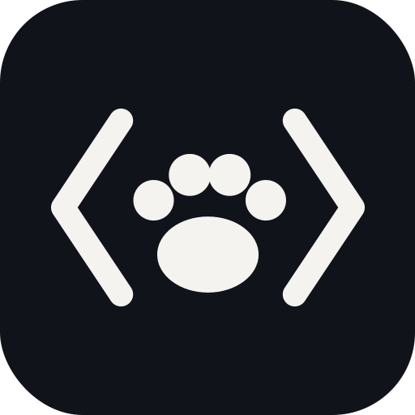
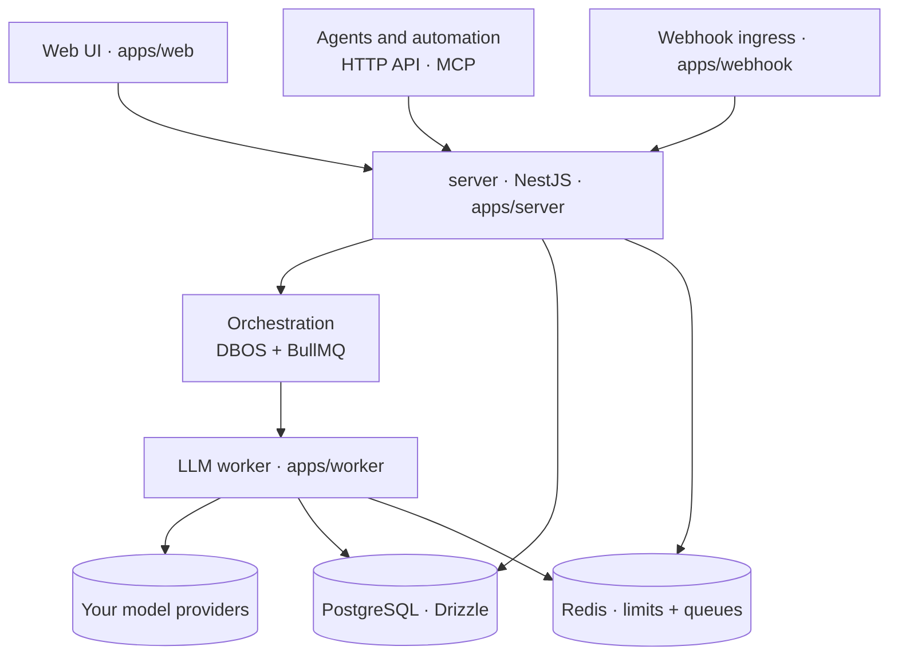

<p align="center">
  
</p>

<h1 align="center">ProofHound</h1>

<p align="center">
  <b>The self-hosted platform that makes prompt engineering far easier</b><br/>
  Across the full lifecycle, with automatic, data-driven optimization built in.<br/>
  Version, regression-test, experiment, optimize, release, and roll back — on data and models you own.
</p>

<p align="center">
  <a href="README.md">English</a> ·
  <a href="README.zh-CN.md">简体中文</a>
</p>

<p align="center">
  <a href="#get-started">Quick start</a> ·
  <a href="#how-it-works">How it works</a> ·
  <a href="https://discord.gg/DGC6AzWrnt">Discord</a>
</p>

<p align="center">
  <a href="https://github.com/proofhound/proofhound"></a>
  <a href="https://discord.gg/DGC6AzWrnt"></a>
  <a href="LICENSE"></a>
  
  
  
  
  
</p>

<p align="center">
  <video src="https://github.com/user-attachments/assets/8290f7f3-0fc8-4464-87b1-d351b3d54fb5" controls muted playsinline width="100%" title="ProofHound quick start demo"></video>
</p>

ProofHound turns prompt engineering into a data-driven, traceable workflow. Instead of stitching together scripts, ad-hoc experiments, spreadsheets, and hand-rolled release logic, you run the whole loop — dataset regression, experiments, automatic optimization, canary and production releases, immutable run results, and rollback — in one place, self-hosted on infrastructure you control.

It is built for developers first: clone, `pnpm dev`, connect a model, and start experimenting in minutes. And because the tuning loop is productized around datasets, metrics, and prompt versions, non-engineering teammates can define goals, launch optimizations, and ship releases too. The open-source edition runs as a single-workspace local admin console and keeps a `project_id` data boundary, so it can later connect to an external control plane without changing core resource semantics.

## What you get

ProofHound runs one lifecycle, and every stage writes to the same fact tables — so a model invocation stays traceable from a dataset sample all the way to production and back:

- **Prompt versions** — every edit creates an immutable version with its variables, output fields, and judgment rules; once an experiment, optimization, or release references it, the version is frozen, so every result maps back to the exact prompt used.
- **Dataset regression** — run a version against a dataset of expected outputs (CSV / TSV / JSONL / JSON / ZIP) and get accuracy, precision, recall, F1, per-class metrics, failed samples, and full invocation details — not an aggregate score that hides minority-class behavior.
- **Experiments** — batch prompt version × dataset × model, then stop, resume, compare across runs, and export; every run is reproducible because the version it used is frozen.
- **Automatic optimization** — analyze failed samples, generate new candidate versions, and re-run regression round by round, targeting class-level goals (e.g. lift recall on a high-risk class) and falling back to the best version when a round regresses.
- **Canary & production releases** — promote a proven version through queue-connector canaries with traffic split and dual-run, then 100% promotion, config updates, rollback, and forced stop; webhook ingress can go straight to production.
- **Run results** — every stage writes one immutable record per call: input variables, rendered prompt, raw output, structured output, judgment, latency, tokens, and cost.
- **Human annotations** — written to a separate table, never mutating the original run results.
- **Connectors** — wire prompts to queue connectors and webhook ingress for online traffic.
- **MCP channel** — built in, so agents can manage prompt versions, start experiments / optimizations, and query results.
- **Bring your own models** — OpenAI, Azure OpenAI, Anthropic, DeepSeek, and more, with your own keys and pricing.

## Get started

You need:

- Node.js 24
- pnpm
- Docker and Docker Compose

PostgreSQL, Redis, and the other local dependency services are started for you by Docker Compose — you do not need to install them manually.

```bash
git clone https://github.com/proofhound/proofhound.git
cd proofhound
pnpm install
cp .env.example .env
pnpm dev
```

`pnpm dev` starts the local dependency services, runs database migrations, and launches server, webhook, worker, and web together.

`cp .env.example .env` ships working local defaults, but replace the model API key encryption secret before any non-local run — see [Configuration](#configuration).

Default local services:

| Service          | Address        |
| ---------------- | -------------- |
| Web UI           | localhost:3000 |
| Server API       | localhost:4000 |
| PostgreSQL       | localhost:5432 |
| Redis            | localhost:6379 |
| Kafka            | localhost:9092 |
| Redpanda Console | localhost:8088 |
| RedisInsight     | localhost:5540 |

## Testing

```bash
pnpm test
pnpm test:e2e
```

`pnpm test` runs the unit test suite. `pnpm test:e2e` runs the Playwright functional suite through an
isolated local stack: it creates/resets `proofhound_e2e`, uses Redis DB 1, starts API, webhook,
worker, web, and the fake LLM server, then stops the app processes after Playwright exits. The suite
prefers API `http://localhost:4200`, webhook `http://localhost:4201`, web `http://localhost:3200`,
and fake LLM port `5599`, but automatically selects nearby free ports when those defaults are
occupied.

To run a single e2e spec:

```bash
pnpm test:e2e e2e/experiment.spec.ts --reporter=line
```

## Configuration

ProofHound reads the repo-root `.env` (used by server, webhook, worker, and the DB scripts; `apps/web` reads `NEXT_PUBLIC_*` from `apps/web/.env.local`). `cp .env.example .env` gives working local defaults — the common variables you may want to set:

| Variable | What it's for | Default |
| --- | --- | --- |
| `MODEL_API_KEY_ENCRYPTION_KEY` | **Required** — encrypts stored model API keys at rest. Generate a real one with `openssl rand -base64 32`. | dev placeholder |
| `DATABASE_URL` | PostgreSQL connection string. | Docker Compose Postgres |
| `REDIS_URL` | Redis connection (rate limits + queues). | Docker Compose Redis |
| `SERVER_PORT` | Server API port. | `4000` |
| `WEB_PUBLIC_URL` | Web origin allowed for CORS. | `http://localhost:3000` |
| `NEXT_PUBLIC_SERVER_URL` | Server URL the web app calls. | `http://localhost:4000` |
| `WORKER_CONCURRENCY` | Per-process `llm` queue concurrency. | `64` |
| `LOG_LEVEL` | Pino log level. | `debug` |

More advanced / optional variables (deploy metadata, DB reset & seeding, tests, the `pnpm probe:model` script, connector demos) are documented inline in [`.env.example`](.env.example).

## Walkthrough

Once ProofHound is running, the manual end-to-end flow from a fresh dataset to a production release is:

1. **Add a model** — register a provider/model with your endpoint, API key, pricing, and RPM / TPM / concurrency limits (start from a [quick preset](#models-and-providers)).
2. **Upload a dataset** — a CSV / TSV / JSONL / JSON / ZIP file, and map the field roles (input text/image, the expected output, metadata).
3. **Write a prompt** — create a prompt and its first version: the template, variables, output fields, and judgment rules.
4. **Run an experiment** — pick a prompt version × dataset × model and run the batch regression; read accuracy / precision / recall / F1, per-class metrics, failed samples, and the full run results.
5. **Inspect and iterate** — review the failed samples, edit the prompt into a new version, and re-run the experiment; repeat until the metrics hit your goal. (Each referenced version is frozen, so every comparison maps back to exact prompt content.)
6. **Release** — bind the winning version to an upstream connector and ship it: a queue connector goes through a canary (traffic split + dual-run) → 100% → production, with rollback and forced stop available; a webhook's first release goes straight to production.

Run results are written for every call along the way, and you can layer human annotations on top without mutating them.

### Skip the manual loop with optimization

Instead of doing step 5 by hand — reading failures, editing the prompt, and re-running round after round — create an **optimization** task: set a goal (e.g. a target accuracy, or recall on a specific class) and a round budget, and it automatically analyzes failed samples, generates new candidate versions, re-runs the regression each round, and keeps the best version.

So with optimization you can **skip step 5** (it automates the loop), and via **Quick start** even **step 3** — the analysis model generates the first prompt version for you. You still do steps 1–2 (a model and a dataset; optimization also uses an analysis model) and step 6 (the release stays your call).

## How it works

ProofHound is a TypeScript monolith split by module boundaries, with a Node.js worker for LLM calls. Three surfaces drive it — the Web UI, an HTTP API + MCP channel for agents and automation, and per-connector webhook ingress for online traffic — and they all share the same orchestration and storage.



| Layer         | Choice                                                                                                  |
| ------------- | ------------------------------------------------------------------------------------------------------- |
| Frontend      | Next.js + TypeScript + Refine + shadcn/ui + Tailwind                                                    |
| Backend       | NestJS monolith, split by module boundaries                                                             |
| Database      | PostgreSQL + Drizzle ORM (`ph_*` schema), no proprietary SQL extensions                                 |
| Orchestration | DBOS + BullMQ + Node.js LLM worker                                                                      |
| Rate limiting | Centralized in Redis (RPM / TPM / concurrency)                                                          |
| Logging       | Pino, stdout JSON; every LLM call is logged with full input and response before run results are written |

## Models and providers

ProofHound does not resell model calls or add a markup on usage — you bring your own providers, and spend stays between you and your provider.

- **Quick presets** — start from a preset for a mainstream provider, then just fill in your credentials, quotas, unit prices, and capability declarations instead of wiring everything by hand.
- **Fully configurable** — per model you set the endpoint, API key, unit prices (for cost tracking), context window, image capability, and RPM / TPM / concurrency limits; limits are enforced centrally in Redis and counted per model.
- **Auto concurrency, on by default** — instead of hand-computing how much concurrency saturates your RPM / TPM, ProofHound tunes the effective in-flight concurrency in real time (Little's Law over observed latency and token usage) and backs off automatically on provider 429s (AIMD), always staying within your configured limit as a safety cap.

Built-in provider types: OpenAI · Azure OpenAI · Anthropic · DeepSeek · Kimi · MiniMax · Qwen · ERNIE — plus any OpenAI-compatible endpoint via an open provider string.

## How ProofHound is different

**Data facts, not intuition.** ProofHound connects samples, judgments, metrics, failure patterns, and version evolution into one loop. Teams spend less time writing scripts, defining ad-hoc structures, and comparing results by hand — and prompt tuning is no longer controlled only by a small group of engineers.

**Built for classification and imbalanced data.** The open-source edition prioritizes classification tasks, especially scenarios with obvious class imbalance such as risk control, finance, moderation, and support-intent detection. Per-class metrics are kept everywhere, so aggregate accuracy never hides minority-class behavior.

**A complete path from experiment to production.** ProofHound is not only a prompt registry, and not only an evaluation tool. Datasets, experiments, optimizations, releases, and run results live in one lifecycle, so you can trace why a version went online, what ran before it, how it behaved in canary and production, and why it was later rolled back.

**Self-hosted, low lock-in.** PostgreSQL for storage, Redis for centralized rate limits, stdout JSON for logs — and your own models, credentials, providers, and usage costs.

## In development

- **Generative-task optimization** — evaluation, comparison, and optimization strategies beyond the current classification-first workflow.
- **ProofHound Cloud** — a hosted edition to cut deployment and operations work. _Coming soon._

## Project structure

```text
proofhound/
├── apps/
│   ├── server     # NestJS API, MCP channel, SSE
│   ├── webhook    # connector webhook ingress
│   ├── worker     # BullMQ LLM worker
│   └── web        # Next.js admin console
├── packages/      # shared, db, crypto, providers, llm-client, judgment,
│                  # optimization-strategy, limiter, metrics, logger,
│                  # orchestration-shared, connector-client, api-client, ui
├── dev/           # docker-compose for local dependency services
├── docs/specs/    # business specs — the source of truth
└── datasets/      # example and local datasets
```

## Contributing

ProofHound is still early, and community contributions are very welcome. You can help by:

- Opening **issues** for bugs, installation problems, model-integration problems, or real workflow feedback.
- Opening **pull requests** for documentation, fixes, tests, or interaction improvements.
- **Extending capabilities** with new model providers, connectors, dataset parsers, experiment metrics, or optimization strategies.
- **Sharing use cases**, especially classification, imbalanced datasets, risk control, finance, moderation, and support-intent detection.

If you are unsure whether an idea fits the project, please open an issue first to discuss the context and expected behavior.

## Community and support

- **Discord** — best for questions, setup help, and chatting with other users: https://discord.gg/DGC6AzWrnt
- **QQ group** — 318412485.
- **GitHub Issues** — best for bugs, installation problems, model-integration problems, and feature requests.
- **Email** — best for private or sensitive topics: z@proofhound.org

## License

ProofHound is licensed under the [Apache License 2.0](LICENSE).
