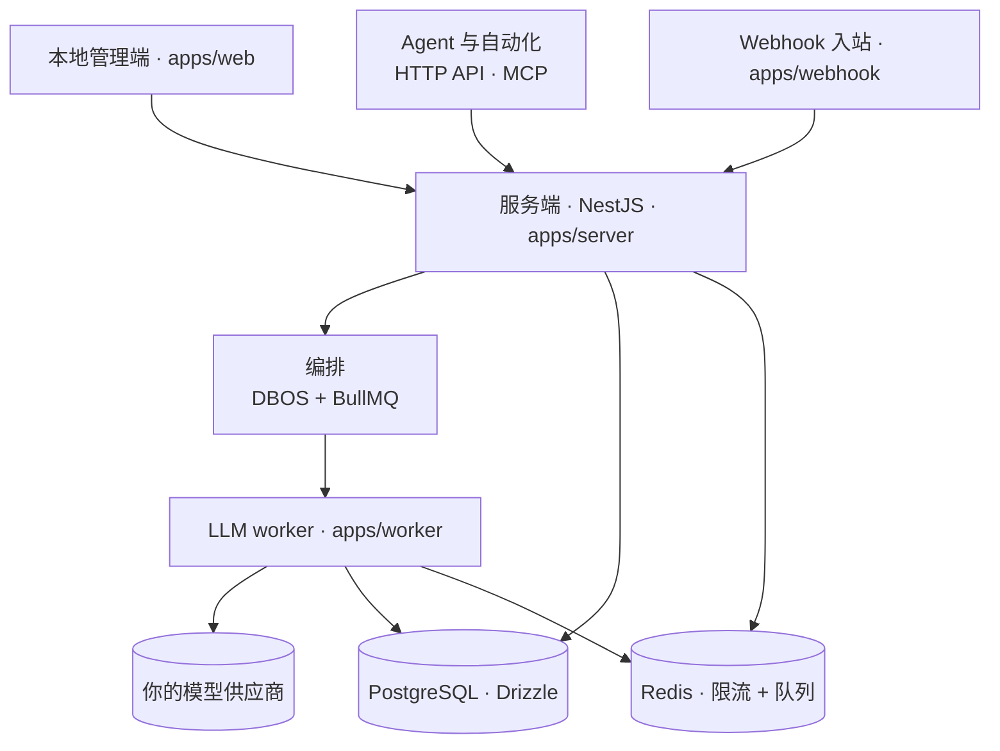

<p align="center">
  
</p>

<h1 align="center">ProofHound</h1>

<p align="center">
  <b>让提示词工程大幅省力的自托管平台</b><br/>
  覆盖完整生命周期，内置数据驱动的自动优化。<br/>
  版本、回归测试、实验、优化、发布、回滚——数据与模型都在你自己手里。
</p>

<p align="center">
  <a href="README.md">English</a> ·
  <a href="README.zh-CN.md">简体中文</a>
</p>

<p align="center">
  <a href="#快速开始">快速开始</a> ·
  <a href="#工作原理">工作原理</a> ·
  <a href="https://discord.gg/DGC6AzWrnt">Discord</a>
</p>

<p align="center">
  <a href="https://github.com/proofhound/proofhound"></a>
  <a href="https://discord.gg/DGC6AzWrnt"></a>
  <a href="LICENSE"></a>
  
  
  
  
  
</p>

<p align="center">
  <video src="https://github.com/user-attachments/assets/8290f7f3-0fc8-4464-87b1-d351b3d54fb5" controls muted playsinline width="100%" title="ProofHound 快速开始演示"></video>
</p>

ProofHound 把提示词工程变成一条数据驱动、可追溯的工作流。过去要靠脚本、临时实验、表格和自己手搓的上线逻辑东拼西凑；现在数据集回归、实验、自动优化、灰度发布与正式发布、不可变的运行结果、回滚，整条闭环都在一处完成，全部自托管在你掌控的基础设施上。

它首先是给开发者用的：clone、`pnpm dev`、接上模型，几分钟就能开跑实验。同时，整套调优流程都围绕数据集、指标和提示词版本做成了产品化能力，所以非技术成员也能定义目标、启动优化、推进发布。开源版就是一个单工作区的本地管理端，并保留 `project_id` 数据边界，便于将来接入外部控制面，又不必改动核心资源语义。

## 能力清单

ProofHound 只有一条生命周期，每个阶段都写入同一套事实表。因此一次模型调用从数据集样本到线上表现的全过程都有迹可循、可双向回溯：

- **提示词版本** —— 每次修改都生成一个不可变版本，连同变量、输出字段与判定规则；一旦被实验、优化或发布引用就会冻结，因此每条结果都能追溯到它当时实际用的那版提示词。
- **数据集回归** —— 用一个版本跑带期望输出的数据集（CSV / TSV / JSONL / JSON 数组 / ZIP），得到 Accuracy、Precision、Recall、F1、分类维度指标、失败样本和完整调用明细，而不是只给一个会掩盖少数类表现的总分。
- **实验** —— 批量跑 提示词版本 × 数据集 × 模型，可停止、恢复、跨轮对比并导出；每次运行都能复现，因为用到的提示词版本已经冻结。
- **自动优化** —— 分析失败样本、生成新的候选版本、逐轮重跑回归，可针对类别级目标（例如提升某高风险类别的 Recall），并在某轮退步时回退到历史最佳版本。
- **灰度与正式发布** —— 把验证过的版本通过队列连接器做灰度发布，支持切流与双跑，再到 100% 晋升、配置变更、回滚与强制停止；webhook 入站可直接进入正式环境。
- **运行结果** —— 以上每个阶段的每次调用都写入一条不可变记录：输入变量、渲染后的提示词、原始输出、结构化输出、判定、耗时、Token 与成本。
- **人工标注** —— 写入独立表，绝不修改原始运行结果。
- **连接器** —— 把提示词接到队列连接器与 webhook 入站，承接线上流量。
- **MCP 通道** —— 内置，Agent 可管理提示词版本、启动实验 / 优化、查询结果。
- **自带模型** —— OpenAI、Azure OpenAI、Anthropic、DeepSeek 等，用你自己的 Key 与定价。

## 快速开始

环境要求：

- Node.js 24
- pnpm
- Docker 与 Docker Compose

PostgreSQL、Redis 等本地依赖服务由 Docker Compose 自动启动，无需手动安装。

```bash
git clone https://github.com/proofhound/proofhound.git
cd proofhound
pnpm install
cp .env.example .env
pnpm dev
```

`pnpm dev` 会启动本地依赖服务、执行数据库迁移，并同时拉起 server、webhook、worker 和 web。

`cp .env.example .env` 已给出一套可直接使用的本地默认值；非本地运行前请先替换模型 API Key 加密密钥（见[配置](#配置)）。

默认本地服务：

| 服务             | 地址           |
| ---------------- | -------------- |
| 本地管理端       | localhost:3000 |
| 服务端 API       | localhost:4000 |
| PostgreSQL       | localhost:5432 |
| Redis            | localhost:6379 |
| Kafka            | localhost:9092 |
| Redpanda Console | localhost:8088 |
| RedisInsight     | localhost:5540 |

## 测试

```bash
pnpm test
pnpm test:e2e
```

`pnpm test` 运行单元测试。`pnpm test:e2e` 运行 Playwright 功能级套件，并自动准备一套隔离的本地
测试栈：创建 / 重置 `proofhound_e2e`，使用 Redis DB 1，启动 API、webhook、worker、web 与 fake LLM
server；Playwright 结束后会停止这些应用进程。套件优先使用 API `http://localhost:4200`、webhook
`http://localhost:4201`、web `http://localhost:3200` 与 fake LLM 端口 `5599`，但默认端口被占用时会
自动选择附近可用端口。

运行单个 e2e spec：

```bash
pnpm test:e2e e2e/experiment.spec.ts --reporter=line
```

## 配置

ProofHound 读取仓库根目录的 `.env`（由 server、webhook、worker 与 DB 脚本使用；`apps/web` 从 `apps/web/.env.local` 读取 `NEXT_PUBLIC_*`）。`cp .env.example .env` 已给出可用的本地默认值——下面列出几个常用、可能需要调整的变量：

| 变量 | 用途 | 默认值 |
| --- | --- | --- |
| `MODEL_API_KEY_ENCRYPTION_KEY` | **必填** —— 加密静态存储的模型 API Key。用 `openssl rand -base64 32` 生成真实密钥。 | 开发占位值 |
| `DATABASE_URL` | PostgreSQL 连接串。 | 指向 Docker Compose 的 Postgres |
| `REDIS_URL` | Redis 连接（限流 + 队列）。 | 指向 Docker Compose 的 Redis |
| `SERVER_PORT` | 服务端 API 端口。 | `4000` |
| `WEB_PUBLIC_URL` | 允许跨域的 Web 来源（CORS）。 | `http://localhost:3000` |
| `NEXT_PUBLIC_SERVER_URL` | Web 应用调用的服务端 URL。 | `http://localhost:4000` |
| `WORKER_CONCURRENCY` | 单进程 `llm` queue 并发。 | `64` |
| `LOG_LEVEL` | Pino 日志级别。 | `debug` |

更高级 / 可选的变量（部署元数据、数据库重置与种子、测试、`pnpm probe:model` 脚本、连接器示例）在 [`.env.example`](.env.example) 内有逐项注释。

## 使用流程

ProofHound 跑起来后，从一份新数据集到正式发布的手动全流程是：

1. **添加模型** —— 配置一个供应商/模型：endpoint、API Key、定价、RPM / TPM / 并发上限（可从[快捷预设](#模型与供应商)开始）。
2. **上传数据集** —— CSV / TSV / JSONL / JSON / ZIP 文件，并映射字段角色（输入文本/图片、期望输出、元数据）。
3. **编写提示词** —— 创建提示词及其第一个版本：模板、变量、输出字段、判定规则。
4. **运行实验** —— 选定 提示词版本 × 数据集 × 模型 跑批量回归；查看 Accuracy / Precision / Recall / F1、分类维度指标、失败样本与完整运行结果。
5. **检查并迭代** —— 看失败样本，把提示词改成新版本，再跑实验；重复直到指标达到目标。（被引用的版本会冻结，因此每次对比都能对应到确切的提示词内容。）
6. **发布** —— 把胜出的版本绑定到上游连接器并上线：队列连接器先走灰度（切流 + 双跑）→ 100% → 正式发布，可回滚、可强制停止；Webhook 的首次发布直接进入正式发布。

整个过程中每次调用都会写入运行结果；你还能在不改动原记录的前提下，为它们补上人工标注。

### 用优化省掉手动迭代

与其手动做第 5 步（逐条看失败、改提示词、一轮轮重跑实验），不如建一个**优化**任务：设一个目标（例如目标准确率，或某个类别的 Recall）和轮次预算，它便会自动分析失败样本、生成新的候选版本、每轮重跑回归，并保留最佳版本。

所以用优化可以**省掉第 5 步**（它自动完成迭代循环），并且经 **Quick start** 连**第 3 步**也能省——分析模型会替你生成第一个提示词版本。第 1–2 步（一个模型 + 一份数据集；优化还需要一个分析模型）和第 6 步（发布仍由你决定）依然要做。

## 工作原理

ProofHound 是一个按模块边界拆分的 TypeScript 单体，配一个负责 LLM 调用的 Node.js worker。它有三个入口：本地管理端、供 Agent 与自动化使用的 HTTP API + MCP 通道，以及按连接器划分的 webhook 入站；三者共享同一套编排与存储。



| 层     | 选型                                                                 |
| ------ | -------------------------------------------------------------------- |
| 前端   | Next.js + TypeScript + Refine + shadcn/ui + Tailwind                 |
| 后端   | NestJS 单体，按模块边界拆分                                          |
| 数据库 | PostgreSQL + Drizzle ORM（`ph_*` schema），不依赖专有 SQL 扩展       |
| 编排   | DBOS + BullMQ + Node.js LLM worker                                   |
| 限流   | Redis 集中限流（RPM / TPM / 并发）                                   |
| 日志   | Pino，stdout JSON；每次 LLM 调用在写入运行结果前都记录完整入参与响应 |

## 模型与供应商

ProofHound 不转卖模型调用，也不在用量上加价：你自带供应商，费用只在你和供应商之间结算，我们不经手。

- **快捷预设** —— 从主流供应商的预设开始，只需填入凭证、配额、单价与能力声明，无需逐项手动配置。
- **充分可配置** —— 每个模型可设置 endpoint、API Key、单价（用于成本核算）、上下文窗口、图片能力，以及 RPM / TPM / 并发上限；限额由 Redis 集中计数、按模型统一执行。
- **自动并发调优，默认开启** —— 无需手算多大并发才能跑满 RPM / TPM；ProofHound 会基于实时延迟和 Token 用量（Little 定律）动态调整有效在途并发，遇到供应商返回 429 时自动退避（AIMD），并始终把你配置的并发上限作为不可越过的兜底上限。

内置供应商类型：OpenAI · Azure OpenAI · Anthropic · DeepSeek · Kimi · MiniMax · Qwen · ERNIE —— 以及任何通过开放字符串接入的 OpenAI 兼容 endpoint。

## ProofHound 的不同之处

**靠数据事实，而非直觉。** ProofHound 把样本、判定、指标、失败模式与版本演化串成一条闭环。团队不必再耗费大量时间写脚本、临时拼数据结构、手工比对结果；提示词调优也不再只攥在少数工程师手里。

**为分类与不均衡数据而建。** 开源版优先服务分类任务，尤其是风控、金融、审核、客服意图识别等类别不均衡明显的场景。分类维度指标贯穿始终，整体准确率绝不掩盖少数类的真实表现。

**从实验到生产的完整链路。** ProofHound 既不是单纯的提示词版本库，也不是单纯的评测工具。数据集、实验、优化、发布与运行结果都在同一条生命周期里，因此可以回溯一个版本为什么上线、上线前跑过哪些验证、在灰度和正式环境表现如何、后来又为什么被回滚。

**自托管，少绑定。** 存储用 PostgreSQL、集中限流用 Redis、日志走 stdout JSON；模型、凭证、供应商和用量成本，全都掌握在你自己手里。

## 开发中

- **生成式任务优化** —— 在当前以分类为先的流程之外，扩展面向生成式任务的评估、比较与优化策略。
- **ProofHound Cloud** —— 托管版，降低部署与运维成本。_即将上线。_

## 项目结构

```text
proofhound/
├── apps/
│   ├── server     # NestJS API、MCP 通道、SSE
│   ├── webhook    # 连接器 webhook 入站
│   ├── worker     # BullMQ LLM worker
│   └── web        # Next.js 本地管理端
├── packages/      # shared, db, crypto, providers, llm-client, judgment,
│                  # optimization-strategy, limiter, metrics, logger,
│                  # orchestration-shared, connector-client, api-client, ui
├── dev/           # 本地依赖服务的 docker-compose
├── docs/specs/    # 业务 SPEC —— 事实来源
└── datasets/      # 示例与本地数据集
```

## 参与贡献

ProofHound 还很早期，非常欢迎社区参与。你可以：

- 提 **Issue**：反馈 Bug、安装问题、模型接入问题或真实工作流反馈。
- 提 **Pull Request**：改进文档、修复问题、补充测试或优化交互体验。
- **扩展能力**：新增模型供应商、连接器、数据集解析、实验指标或优化策略。
- **分享场景**：尤其欢迎分类、不均衡数据集、风控、金融、审核、客服意图识别等场景。

如果不确定某个想法是否契合项目，建议先开 Issue 讨论背景与预期行为。

## 社区与支持

- **Discord** —— 最适合提问、求助安装、与其他用户交流：https://discord.gg/DGC6AzWrnt
- **QQ 群** —— 318412485。
- **GitHub Issues** —— 最适合 Bug、安装问题、模型接入问题与功能请求。
- **邮箱** —— 最适合私密或敏感话题：z@proofhound.org

## 许可证

ProofHound 基于 [Apache License 2.0](LICENSE) 开源。
