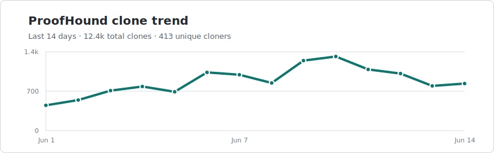
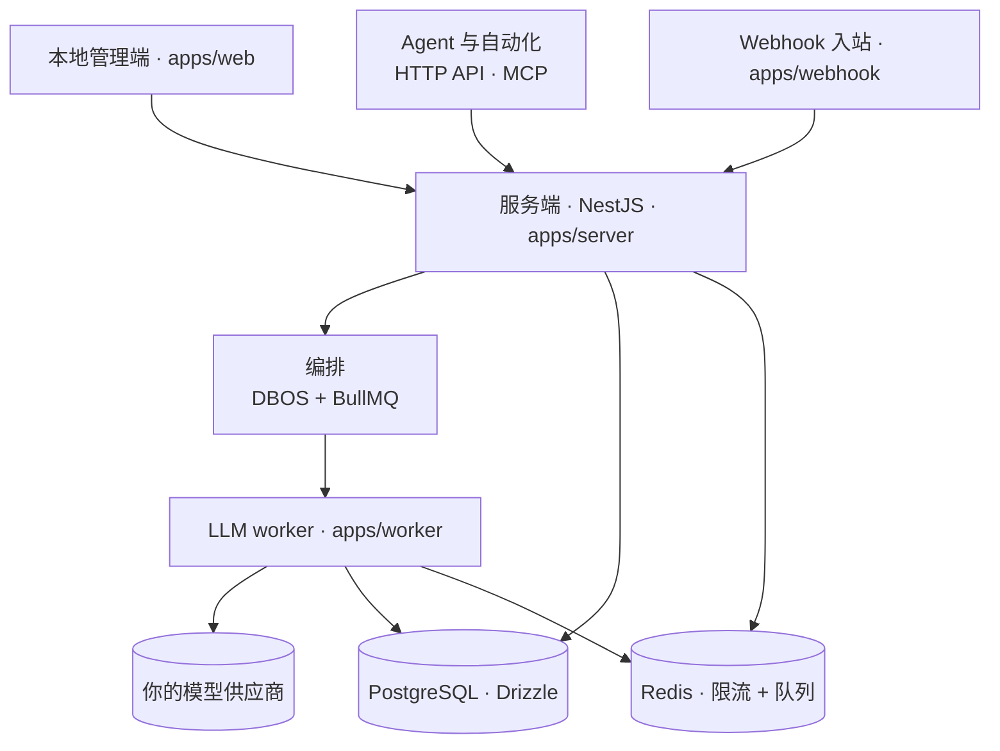

<p align="center">
  <a href="https://proofhound.org">
    
  </a>
</p>

<h1 align="center">ProofHound</h1>

<p align="center">
  <b>显著降低提示词调优成本的自托管平台</b><br/>
  覆盖提示词全生命周期，内置数据驱动的自动化优化。<br/>
  版本管理、回归测试、实验迭代、自动优化、灰度发布、版本回滚一应俱全。
</p>

<p align="center">
  <strong><a href="https://proofhound.org">proofhound.org</a></strong> ·
  <a href="https://proofhound.org">预约 ProofHound Cloud 早期席位</a>
</p>

<p align="center">
  <a href="README.md">English</a> ·
  <a href="README.zh-CN.md">简体中文</a>
</p>

<p align="center">
  <a href="#快速开始">快速开始</a> ·
  <a href="#工作原理">工作原理</a> ·
  <a href="https://discord.gg/DGC6AzWrnt">Discord</a>
</p>

<p align="center">
  <a href="https://proofhound.org"></a>
  <a href="https://github.com/proofhound/proofhound"></a>
  <a href="https://discord.gg/DGC6AzWrnt"></a>
  <a href="LICENSE"></a>
  
  
  
  
  
</p>

<p align="center">
  
</p>

<p align="center">
  <video src="https://github.com/user-attachments/assets/8290f7f3-0fc8-4464-87b1-d351b3d54fb5" controls muted playsinline width="100%" title="ProofHound 快速开始演示"></video>
</p>

ProofHound 一站式管理提示词全生命周期，内置数据驱动自动迭代优化，支持完整自托管部署，彻底简化提示词调优流程。

版本管理、回归测试、实验迭代、自动优化、灰度发布、版本回滚等能力一应俱全，所有业务数据与模型资源均由你自主掌控。传统提示词工程流程零散，往往需要依靠自定义脚本、临时实验、表格统计以及零散的上线逻辑拼凑完成。借助 ProofHound，数据集回归校验、批量实验、自动优化、灰度发布、正式发布、运行结果与版本回滚可形成完整闭环，所有操作统一在平台内完成，且支持全量自托管部署，依托自有基础设施保障数据安全。

本项目对开发者十分友好：拉取代码、执行 `pnpm dev`、接入大模型，短短几分钟即可启动实验。同时，整套调优流程基于数据集、量化指标与提示词版本做产品化封装，非技术人员也能按需设定优化目标、启动迭代任务、推进版本上线。开源版默认采用单工作区架构，通过 `project_id` 实现数据隔离，后续对接外部管控平台时，无需改动核心业务逻辑与数据结构。

## 能力清单

ProofHound 采用统一的生命周期设计，全流程数据写入同一套事实表。从数据集样本输入，到模型线上调用效果，每一次调用都全程可追溯、双向可核查。

- **提示词版本管理** —— 每次修改都会生成不可变版本，完整留存模板变量、输出字段及结果判定规则。一旦版本被实验、优化任务或线上服务引用，将自动锁定，确保每一条运行记录都能精准对应当时生效的提示词内容。
- **数据集回归校验** —— 基于标注数据集开展回归测试，支持 CSV、TSV、JSONL、JSON 数组、ZIP 等多种格式。自动计算准确率、精确率、召回率、F1 值以及各分类细分指标，同时输出错误样本与完整调用日志，避免单一总分掩盖小众分类的真实表现。
- **批量实验** —— 支持「提示词版本 + 数据集 + 模型」多维度组合批量测试，实验任务可暂停、恢复、跨轮对比与数据导出。依托版本锁定机制，所有实验结果均可复现。
- **自动优化** —— 自动分析错误样本、生成候选提示词版本并多轮执行回归测试。支持针对单一分类做定向优化（例如提升高风险分类的召回率），若迭代效果下滑，将自动回退至历史最优版本。
- **灰度发布与正式发布** —— 经过验证的版本可通过队列连接器实现灰度放量，支持流量切分、新旧版本并行运行，平稳过渡至全量发布；同时提供配置变更、版本回滚、强制停止能力。基于 Webhook 的接入方式可直接对接生产环境。
- **运行结果** —— 实验、优化、发布等所有环节的每一次调用，都会生成不可变记录，完整保存输入变量、渲染后提示词、模型原始输出、结构化结果、判定结论、耗时、Token 消耗及调用成本。
- **人工标注** —— 标注数据独立存储，不会篡改原始运行结果，便于后续对照分析。
- **流量连接器** —— 通过队列与 Webhook 两种接入方式，将提示词服务对接线上正式流量。
- **MCP 通道** —— 平台原生内置该能力，AI Agent 可远程管理提示词版本、启动实验与优化任务、查询运行数据。
- **模型适配** —— 原生兼容 OpenAI、Azure OpenAI、Anthropic、DeepSeek 等主流大模型，全程使用你自己的 API 密钥与计费方案。

## 快速开始

环境要求：

- Node.js 24
- pnpm
- Docker 与 Docker Compose

PostgreSQL、Redis 等本地依赖服务由 Docker Compose 自动启动，无需手动安装。

```bash
git clone https://github.com/proofhound/proofhound.git
cd proofhound
pnpm install
cp .env.example .env
pnpm dev
```

执行 `pnpm dev` 后，系统会自动启动依赖服务、执行数据库迁移，并同步拉起服务端、Webhook、任务 Worker 以及前端管理页面。

项目已通过 `.env.example` 提供开箱即用的本地默认配置，执行 `cp .env.example .env` 即可启用。正式部署前，请务必更换模型 API 密钥的加密密钥，具体配置说明见下文。

本地服务默认地址：

| 服务            | 地址           |
| --------------- | -------------- |
| 本地管理端      | localhost:3000 |
| 服务端 API      | localhost:4000 |
| PostgreSQL      | localhost:5432 |
| Redis           | localhost:6379 |
| Kafka           | localhost:9092 |
| Redpanda 控制台 | localhost:8088 |
| RedisInsight    | localhost:5540 |

## 测试

```bash
pnpm test
pnpm test:e2e
```

执行 `pnpm test` 可运行单元测试。执行 `pnpm test:e2e` 会启动 Playwright 端到端测试套件，并自动构建隔离的本地测试环境：创建 / 重置独立数据库 `proofhound_e2e`、使用 Redis 第 1 号库，同时启动 API、Webhook、Worker、前端页面以及模拟 LLM 服务。测试结束后，所有应用进程将自动停止。

测试环境默认端口如下：API `http://localhost:4200`、Webhook `http://localhost:4201`、前端 `http://localhost:3200`、模拟 LLM 服务 `5599`。若端口被占用，程序会自动选取附近可用端口。

运行单个 e2e spec：

```bash
pnpm test:e2e e2e/experiment.spec.ts --reporter=line
```

## 配置说明

项目根目录下的 `.env` 为核心配置文件，服务端、Webhook、任务 Worker、数据库脚本均会读取该文件；前端项目独立使用 `apps/web/.env.local`，仅加载以 `NEXT_PUBLIC_` 开头的环境变量。

`cp .env.example .env` 可快速生成本地配置文件，以下为常用配置项说明：

| 变量                           | 用途                                                                                           | 默认值                          |
| ------------------------------ | ---------------------------------------------------------------------------------------------- | ------------------------------- |
| `MODEL_API_KEY_ENCRYPTION_KEY` | **必填** —— 用于加密持久化存储的模型 API 密钥。可执行 `openssl rand -base64 32` 生成安全密钥。 | 开发占位密钥                    |
| `DATABASE_URL`                 | PostgreSQL 数据库连接地址。                                                                    | 指向 Docker Compose 的 Postgres |
| `REDIS_URL`                    | Redis 连接地址（用于流量限流、任务队列）。                                                     | 指向 Docker Compose 的 Redis    |
| `SERVER_PORT`                  | 服务端 API 监听端口。                                                                          | `4000`                          |
| `WEB_PUBLIC_URL`               | 前端站点地址，用于配置跨域白名单（CORS）。                                                     | `http://localhost:3000`         |
| `NEXT_PUBLIC_SERVER_URL`       | 前端调用服务端接口的地址。                                                                     | `http://localhost:4000`         |
| `WORKER_CONCURRENCY`           | 单进程 LLM 任务队列最大并发数。                                                                | `64`                            |
| `LOG_LEVEL`                    | Pino 日志输出级别。                                                                            | `debug`                         |

更多高阶配置项（部署参数、数据库初始化、测试脚本、模型探测脚本、连接器示例等），可参考 [`.env.example`](.env.example) 文件内的详细注释。

## 使用流程

平台部署完成后，从导入数据集到版本正式发布，完整手动流程如下：

1. **添加模型** —— 配置模型厂商与服务信息，包括接口地址、API 密钥、计费规则、RPM / TPM 上限、并发限制，也可直接使用平台预设模板快速接入。
2. **上传数据集** —— 支持 CSV、TSV、JSONL、JSON、ZIP 等格式，可视化映射字段用途（输入文本 / 图片、预期输出、元数据）。
3. **创建提示词** —— 编写提示词模板并生成首个版本，配置模板变量、输出格式与结果判定规则。
4. **运行实验** —— 组合提示词版本、数据集与模型开展批量回归测试，查看准确率、精确率、召回率、F1 值、分类指标、错误样本及完整运行结果。
5. **迭代优化** —— 分析错误样本，迭代生成新的提示词版本并重复实验，直至指标达标。被引用的版本会自动锁定，保证版本对比精准有效。
6. **版本发布** —— 将最优版本绑定流量连接器并上线。队列连接器采用「灰度放量 → 全量发布」的流程，支持版本回滚与强制停止；Webhook 接入可直接部署至生产环境。

全流程的每一次调用都会留存运行结果，你也可以在不修改原始数据的前提下，补充人工标注用于后续分析。

### 借助自动优化，替代手动迭代

上述第 5 步人工迭代流程繁琐，你可以直接创建自动优化任务：设置优化目标（如整体准确率、指定分类召回率）与最大迭代轮次。平台会自动分析错误样本、生成新版提示词、多轮执行回归测试，并持续保留最优版本。

使用自动优化能力可完全省去人工迭代环节。配合平台快捷能力，甚至可以自动生成初始提示词版本。你仅需完成「配置模型、上传数据集」两步（自动优化额外需要一个分析模型），最终上线环节仍由人工把控。

## 工作原理

ProofHound 是基于 TypeScript 开发的模块化单体应用，搭配独立 Node.js Worker 进程专门处理 LLM 调用任务。平台提供三类访问入口：本地管理端、面向 AI Agent 与自动化场景的 HTTP API + MCP 通道、按业务划分的 Webhook 流量入口。三类入口共享同一套任务编排与数据存储体系。



| 分层     | 技术方案                                                                                      |
| -------- | --------------------------------------------------------------------------------------------- |
| 前端     | Next.js + TypeScript + Refine + shadcn/ui + Tailwind                                          |
| 后端     | NestJS 单体架构，按业务模块拆分                                                               |
| 数据库   | PostgreSQL + Drizzle ORM（自定义 `ph_*` 数据表），不依赖数据库私有扩展语法                    |
| 任务编排 | DBOS + BullMQ + Node.js LLM Worker                                                            |
| 限流方案 | 基于 Redis 实现集中式限流，管控 RPM、TPM、并发量                                              |
| 日志方案 | 使用 Pino 输出标准 JSON 日志至控制台；每一次 LLM 调用，都会在写入结果前完整记录入参与响应内容 |

## 模型与厂商对接

ProofHound 不代理模型调用、不收取额外服务费。你自主选择模型厂商并使用自有账户，费用仅由你与厂商结算。

- **快捷预设** —— 内置主流模型厂商模板，仅需填写凭证、调用配额、单价与能力描述，无需逐项手动配置。
- **高度自定义** —— 支持自定义接口地址、API 密钥、计费单价、上下文窗口、图片能力、RPM / TPM 及并发上限；所有限流规则由 Redis 统一计数与执行。
- **智能动态并发，默认开启** —— 无需人工计算最优并发数，平台结合接口延迟、Token 消耗（Little 定律）动态调整并发量；当收到厂商 429 限流响应时，会采用 AIMD 算法自动退避，且始终不会超出你配置的并发上限。

平台原生支持：OpenAI · Azure OpenAI · Anthropic · DeepSeek · Kimi · MiniMax · Qwen · ERNIE —— 同时兼容任何通过开放字符串接入的 OpenAI 兼容 endpoint。

## 产品核心特色

**以数据为依据，告别经验式调优。** 平台打通样本数据、判定结果、量化指标、错误案例与版本迭代全链路。团队无需重复编写脚本、拼装数据、人工比对结果，提示词调优也不再依赖少数人员的个人经验。

**专为分类任务与不均衡数据集打造。** 开源版优先面向分类场景深度优化，适配风控、金融审核、内容合规、客服意图识别等常见业务，这类场景普遍存在数据分类不均衡问题。平台全链路展示分类维度指标，不会用整体准确率掩盖小众分类的真实问题。

**打通从实验到生产的完整链路。** 本产品不只是单纯的版本管理工具或评测工具，数据集、实验、优化、发布、运行结果融为一体。你可以完整追溯一个版本的上线原因、前置验证内容、灰度与线上表现，以及版本回滚的完整过程。

**纯自托管部署，低耦合无绑定。** 采用 PostgreSQL、Redis 等通用开源组件，日志输出标准 JSON 格式。模型、密钥、厂商账户、调用数据与成本，全部由你全权掌控。

## 开发规划

- **生成式任务优化** —— 在现有分类任务能力基础上，拓展生成式大模型的评估、对比与自动优化能力。
- **ProofHound Cloud** —— 推出云端托管版本，降低部署与运维成本。可访问 [proofhound.org](https://proofhound.org) 预约早期体验资格。

## 项目结构

```text
proofhound/
├── apps/
│   ├── server     # NestJS API、MCP 通道、SSE
│   ├── webhook    # 连接器 webhook 入站
│   ├── worker     # BullMQ LLM worker
│   └── web        # Next.js 本地管理端
├── packages/      # shared, db, crypto, providers, llm-client, judgment,
│                  # optimization-strategy, limiter, metrics, logger,
│                  # orchestration-shared, connector-client, api-client, ui
├── dev/           # 本地依赖服务的 docker-compose
├── docs/specs/    # 业务 SPEC —— 事实来源
└── datasets/      # 示例与本地数据集
```

## 参与贡献

项目目前处于早期迭代阶段，欢迎社区开发者共同参与共建：

- 提 **Issue**：反馈 Bug、部署问题、模型接入异常或分享实际落地经验。
- 提 **Pull Request**：优化文档、修复缺陷、补充测试用例、优化交互体验。
- **拓展功能**：新增模型厂商适配、连接器、数据集解析规则、实验指标、优化算法等。
- **场景分享**：欢迎分享分类任务、不均衡数据集、风控、金融、内容审核、客服意图识别等落地场景。

若你有新的功能想法，建议先新建 Issue 沟通方案，确认与项目定位一致后再开发。

## 社区与支持

- **官网** —— 产品介绍、文档入口、Cloud 内测预约：https://proofhound.org
- **Discord** —— 技术答疑、安装求助、社区交流：https://discord.gg/DGC6AzWrnt
- **QQ 交流群** —— 318412485
- **GitHub Issues** —— 反馈 Bug、部署问题、模型适配问题、功能建议
- **联系邮箱** —— 商务合作、私密沟通：z@proofhound.org

## 开源许可证

ProofHound 基于 [Apache License 2.0](LICENSE) 协议开源。
